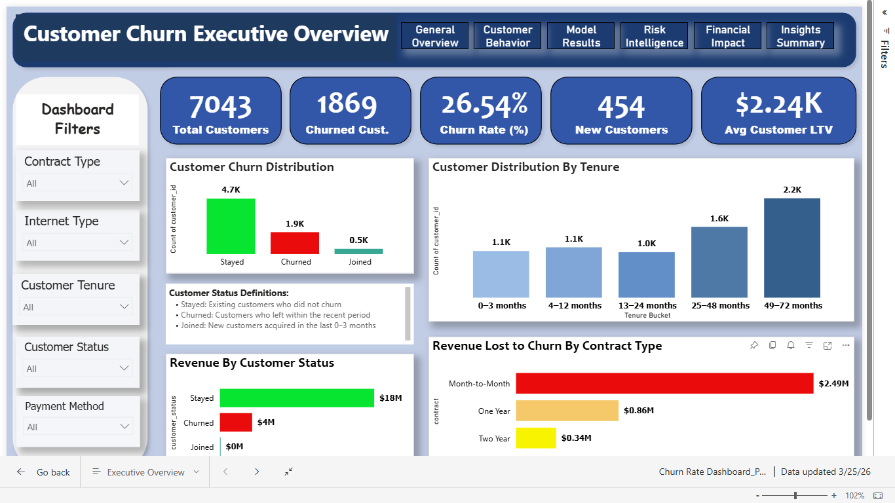
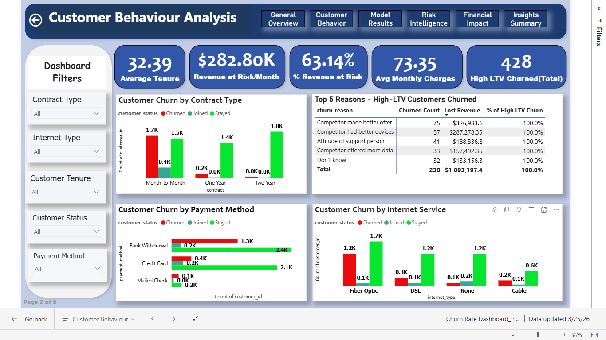
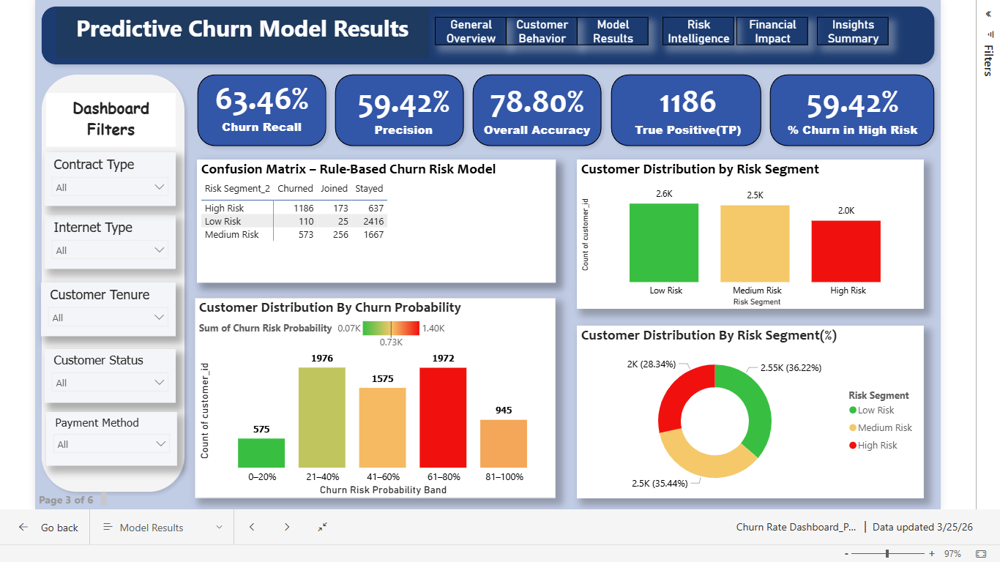
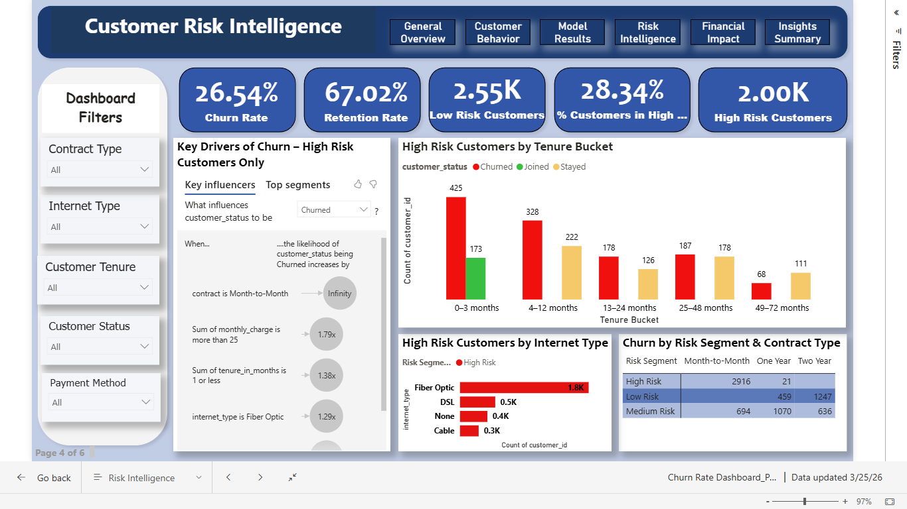
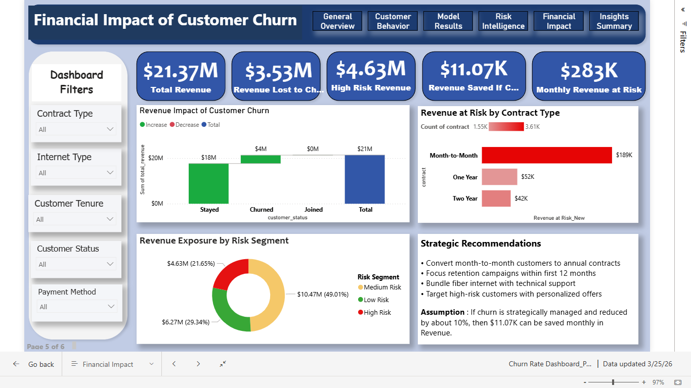
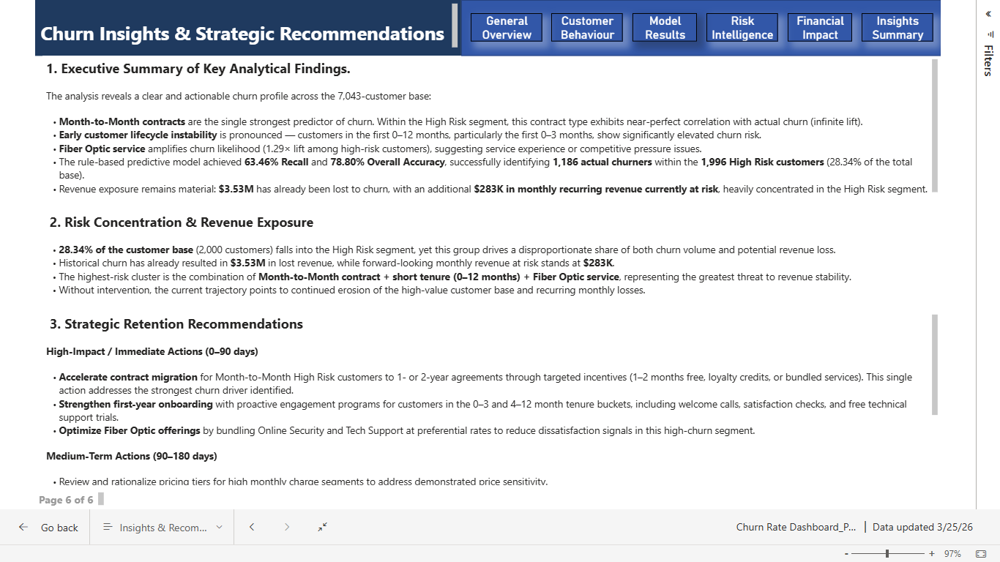

# Telco Customer Churn Analysis Dashboard

A comprehensive 6-page interactive Power BI dashboard designed to analyze customer churn, identify high-risk segments, quantify revenue impact, and deliver strategic retention recommendations for a telecommunications company.

## Project Overview

This end-to-end churn analytics solution helps telecom businesses understand **why customers churn**, **who will churn next**, **which segments are at highest risk**, and **how much revenue is exposed**.

This was built using Telco Customer Churn dataset from kaggle, the dashboard features a custom rule-based predictive model, risk segmentation, financial exposure analysis, and prioritized action plans.

## Key Outcomes

- Identified **Month-to-Month contracts** as the strongest churn driver (near-perfect correlation in the High Risk segment).
- Highlighted **early tenure instability** (0–12 months) and **Fiber Optic service** as major risk amplifiers.
- Developed a rule-based churn risk model with **63.46% Recall** and **78.80% Accuracy**, successfully identifying **1,186 actual churners** within the **1,996 High Risk customers** (28.34% of total base).
- Quantified **$3.53M** in historical revenue lost and **$283K** in monthly recurring revenue currently at risk.

## Dashboard Pages

| Page | Title                              | Focus Area                                      |
|------|------------------------------------|-------------------------------------------------|
| 1    | Executive Overview                 | High-level KPIs and revenue at risk             |
| 2    | Customer Behaviour Analysis        | Churn patterns by contract, internet & payment  |
| 3    | Predictive Churn Model Results     | Model performance and accuracy                  |
| 4    | Customer Risk Intelligence         | High-risk segmentation and key drivers          |
| 5    | Financial Impact of Customer Churn | Revenue exposure and potential savings          |
| 6    | Churn Insights & Strategic Recommendations | Key findings and prioritized actions     |

## Screenshots

## Files

- `Churn_Rate_Dashboard_PowerBI.pbix` → Full interactive Power BI report
- `Screenshots/` → High-resolution images of all six pages

## Live Report

**Interactive Dashboard:**  
[View Live Report](https://bit.ly/3PsTLY1)  

> **Note:** Viewing the live report requires a Power BI Pro license or free trial. Full .pbix file and screenshots are available in this repository.

## Technologies Used

- Power BI Desktop
- Advanced DAX (Calculated Columns & Measures)
- Rule-based Predictive Scoring
- Key Influencers Visual & Interactive Filtering

## About This Project

This dashboard was developed as a complete churn analytics project to demonstrate strong capabilities in:
- Business problem translation into analytics solutions
- Data modeling and DAX development
- Building executive-ready dashboards with clear storytelling
- Delivering actionable insights with measurable financial impact

---

