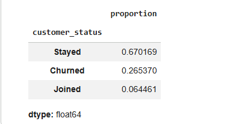
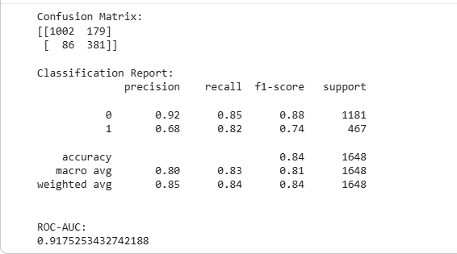
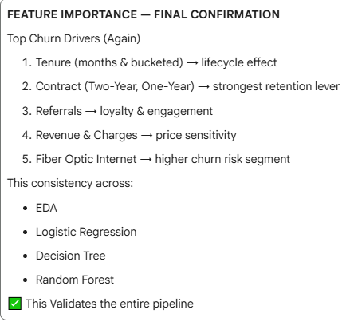

# Customer Churn Prediction — Telecom Analytics Case Study

## 📌 Executive Summary
This project presents an end-to-end customer churn analysis and prediction system using telecom customer data. The objective was to identify key drivers of churn, predict customers at risk of leaving, and translate analytical insights into actionable business strategies for customer retention.

The project covers the full analytics lifecycle — from raw data ingestion and cleaning, through exploratory analysis and feature engineering, to machine learning model development and evaluation.

The final solution delivers a production-ready churn prediction model with strong recall and clear business interpretability.

---

## Why This Project Matters
Customer churn is one of the largest revenue risks for telecom and subscription-based businesses. 
This project demonstrates how data analysis and machine learning can be used to identify at-risk customers early, 
design targeted retention strategies, and support data-driven decision-making across marketing and customer success teams.

---

## 🎯 Key Outcomes
- Identified early-tenure, month-to-month customers as the highest churn risk segment
- Built and evaluated multiple ML models (Logistic Regression, Decision Tree, Random Forest)
- Selected Random Forest as the final model based on recall, ROC-AUC, and stability
- Translated model insights into actionable retention strategies

---

## 🏢 Business Problem
Customer churn is a major revenue challenge in the telecom industry. Acquiring new customers is significantly more expensive than retaining existing ones.  

The business goal of this project is to:
- Identify customers at high risk of churning
- Understand *why* customers churn
- Enable proactive retention strategies

---

## 📊 Data Overview
- Source: Public telecom customer dataset (Kaggle)
- Records: ~7,000 customers
- Features include:
  - Customer demographics
  - Contract and billing information
  - Service subscriptions
  - Usage behavior
  - Churn status and reasons

---

## 🔍 Analytical Approach
The project followed a structured analytics workflow:

1. **Data Understanding & Profiling**
2. **Data Cleaning & Validation**
3. **Exploratory Data Analysis (EDA)**
4. **Feature Engineering**
5. **Model Development**
   - Logistic Regression (baseline)
   - Decision Tree (explainability)
   - Random Forest (final model)
6. **Model Evaluation & Selection**
7. **Business Interpretation & Documentation**

---

## 🧠 Key Insights
- Customers in their first year are at the highest risk of churn
- Month-to-month contracts significantly increase churn probability
- Long-term contracts strongly reduce churn
- High monthly charges increase churn risk
- Customer engagement indicators (e.g., referrals, add-on services) reduce churn

## 📊 Key Visual Insights

### Churn Distribution


### Random Forest Model Performance


### Key Churn Drivers


---

## 🤖 Modeling Summary
| Model | Purpose | Outcome |
|-----|--------|--------|
| Logistic Regression | Baseline & interpretability | High recall |
| Decision Tree | Rule extraction | Clear churn rules |
| Random Forest | Final model | Best balance of performance |

Random Forest was selected as the final model due to its strong balance between churn recall, predictive robustness, and ability to capture non-linear customer behavior.


**Final Model Selected:** Random Forest  
- ROC-AUC ≈ 0.92  
- Strong recall for churn detection  
- Robust and production-ready

---

## 📈 Business Impact
The final model enables:
- Early identification of high-risk customers
- Targeted retention campaigns
- Contract upgrade strategies
- Revenue loss reduction through proactive intervention

---

## 📁 Repository Structure
```text
Telco-Churn-Analysis/
│
├── Case-Study/          # Business & analytical documentation
├── Data/
│   ├── Raw/             # Original datasets
│   └── Processed/       # Cleaned data
├── Python_ML_Version/   # Folder hosting all ML analytical documentation
├── Notebooks/           # Analysis and modeling notebooks
├── Images/              # (Optional) Dashboard files
└── README.md

---

## 👤 Author
**Ezugwu Desmond**  
Data Analyst | Telecom Analytics | Predictive Modeling  
Open to Remote & Global Opportunities
